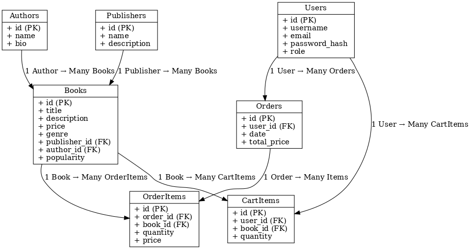

# 📚 Online Bookstore API

## Description
This project is an **Online Bookstore** web application.  

Main features:  
- Browse books with search, filtering, and sorting.  
- View detailed information about books, authors, and publishers.  
- Manage books, authors, and publishers (CRUD operations).  
- User registration and authentication.  
- User profile with order history.  
- Shopping cart and order creation.  
- Static "About Us" page with contact and delivery info.  

The backend exposes a **REST API** that returns and accepts data in **JSON format**.

---

## API Endpoints

### 📖 Books
| Method | Endpoint             | Description                    | Request Body | Response |
|--------|----------------------|--------------------------------|--------------|----------|
| GET    | `/api/books`         | Get all books (with filters)   | -            | List of books |
| GET    | `/api/books/{id}`    | Get details of a book          | -            | Book object |
| POST   | `/api/books`         | Create new book (Admin only)   | `{ "title": "...", "author_id": 1, "publisher_id": 2, "price": 15.99, "genre": "Sci-Fi" }` | Created book |
| PUT    | `/api/books/{id}`    | Update book (Admin only)       | Same as POST | Updated book |
| DELETE | `/api/books/{id}`    | Delete book (Admin only)       | -            | Status 204 |

---

### ✍️ Authors
| Method | Endpoint               | Description                     | Request Body | Response |
|--------|------------------------|---------------------------------|--------------|----------|
| GET    | `/api/authors`         | List all authors                | -            | List of authors |
| GET    | `/api/authors/{id}`    | Get author details + their books| -            | Author object with books |
| POST   | `/api/authors`         | Create new author (Admin only)  | `{ "name": "John Smith", "bio": "..." }` | Created author |
| PUT    | `/api/authors/{id}`    | Update author info (Admin only) | `{ "name": "...", "bio": "..." }` | Updated author |
| DELETE | `/api/authors/{id}`    | Delete author (Admin only)      | -            | Status 204 |

---

### 🏢 Publishers
| Method | Endpoint                  | Description                        | Request Body | Response |
|--------|---------------------------|------------------------------------|--------------|----------|
| GET    | `/api/publishers`         | List all publishers                | -            | List of publishers |
| GET    | `/api/publishers/{id}`    | Get publisher details + their books| -            | Publisher object with books |
| POST   | `/api/publishers`         | Create new publisher (Admin only)  | `{ "name": "O'Reilly", "description": "..." }` | Created publisher |
| PUT    | `/api/publishers/{id}`    | Update publisher (Admin only)      | `{ "name": "...", "description": "..." }` | Updated publisher |
| DELETE | `/api/publishers/{id}`    | Delete publisher (Admin only)      | -            | Status 204 |

---

### 👤 Authentication & Users
| Method | Endpoint          | Description            | Request Body | Response |
|--------|-------------------|------------------------|--------------|----------|
| POST   | `/api/register`   | Register new user      | `{ "username": "alice", "email": "alice@mail.com", "password": "12345" }` | User object |
| POST   | `/api/login`      | Login user, get token  | `{ "email": "alice@mail.com", "password": "12345" }` | `{ "token": "..." }` |
| GET    | `/api/profile`    | Get profile (Auth req) | -            | User profile + orders |
| PUT    | `/api/profile`    | Update profile         | `{ "username": "...", "email": "..." }` | Updated profile |

---

### 🛒 Cart & Orders
| Method | Endpoint              | Description             | Request Body | Response |
|--------|-----------------------|-------------------------|--------------|----------|
| GET    | `/api/cart`           | View cart (Auth req)    | -            | Cart items |
| POST   | `/api/cart`           | Add book to cart        | `{ "book_id": 1, "quantity": 2 }` | Updated cart |
| DELETE | `/api/cart/{book_id}` | Remove book from cart   | -            | Updated cart |
| POST   | `/api/orders`         | Place order             | -            | Created order |
| GET    | `/api/orders`         | View user orders        | -            | List of orders |

---

### ℹ️ About
| Method | Endpoint     | Description                | Response |
|--------|--------------|----------------------------|----------|
| GET    | `/api/about` | Get static info (contacts, delivery, returns) | `{ "contacts": "...", "delivery": "...", "returns": "..." }` |

---

## Database Schema

### Entities
- **Users**: id, username, email, password_hash, role  
- **Books**: id, title, description, price, genre, publisher_id, author_id, popularity  
- **Authors**: id, name, bio  
- **Publishers**: id, name, description  
- **Orders**: id, user_id, date, total_price  
- **OrderItems**: id, order_id, book_id, quantity, price  
- **CartItems**: id, user_id, book_id, quantity  

